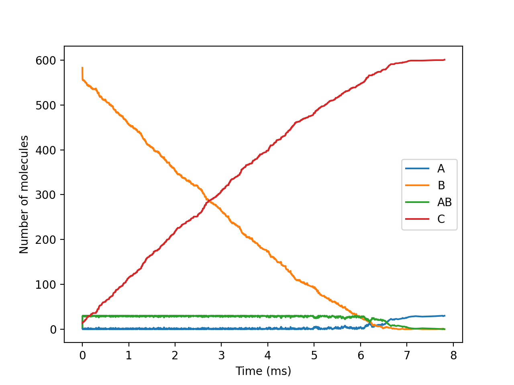
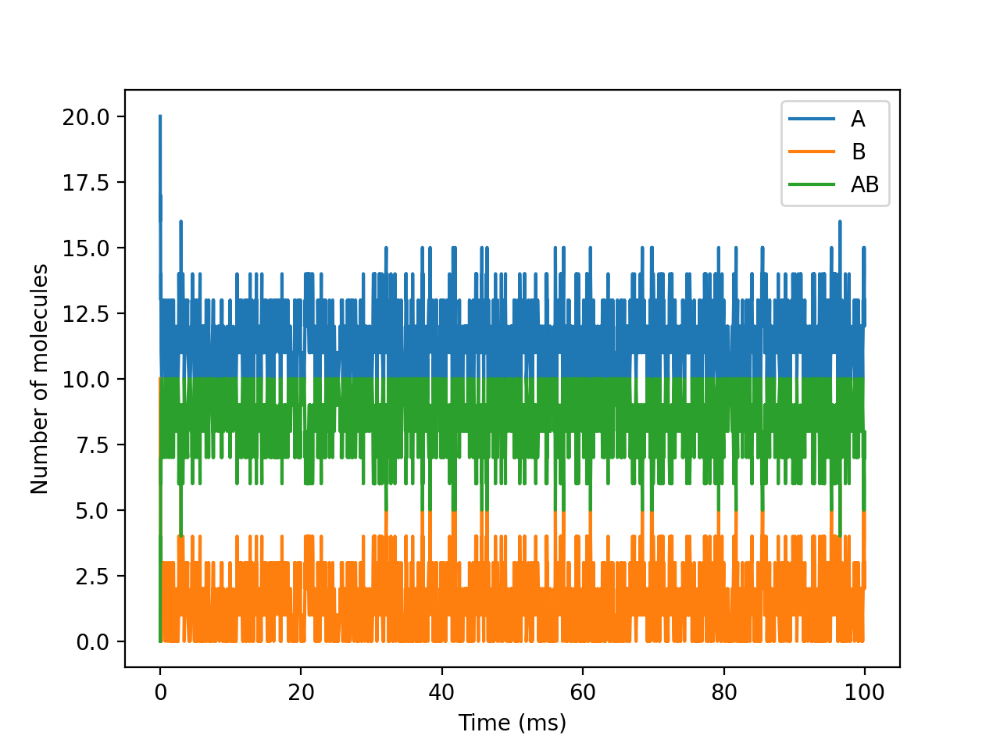

# Gillespie Stochastic Simulation Algorithm
Python implementation of Gillespie's Stochastic Algorithm to simulate the evolution of the concentration of species in a chemical system.

Fernando Peña Bes, *Universidad de Zaragoza*

## How to execute
It's recommended to execute the program in  a virtual environment, in order to avoid problems with Python versions and packages dependencies.

These are the steps for using `venv`:

1. Go to que project's root directory and create the virtual environment with the following command:

	```
	python3 -m venv gillespie_env
	```

2. Next, activate the environment:

	```
	source gillespie_env/bin/activate
	```

3. Finally, install the required packages:

	```
	pip install -r requirements.txt
	```

## Input

A string describing the system, with the next format:

```
# Example system

# Initial and final simulation times
initial_time = 0
final_time = 100

# System reactions
r1: A -> B; k1
r2: B -> C; k2

# Values of the reactions constants
k1 = 0.11
k2 = 0.1

# Initial species concentrations
A = 100
B = 0
C = 0
```

Everything from the `#` character to the end of the line is considered a comment.

## Usage
```
import gillespie
gillespie.run_simulation(system_string)
```

## Examples
The file `examples.py` contains three example systems. They can be run with the following command:

```
python3 examples.py
```

These are the results of the simulations:

|Example 1|Example 2|Example 3|
|:---:|:---:|:---:|
||||

## References
* Daniel T. Gillespie, *A General Method for Numerically Simulating the Stochastic Time Evolution of Coupled Chemical Reactions* (1976): <http://web.mit.edu/endy/www/scraps/signal/JCompPhys(22)403.pdf>
* Daniel T. Gillespie, *Exact Stochastic Simulation of Coupled Chemical Reactions* (1977): <http://www.stat.yale.edu/~jtc5/GeneticNetworksGroup/Gillespie1977.pdf>
